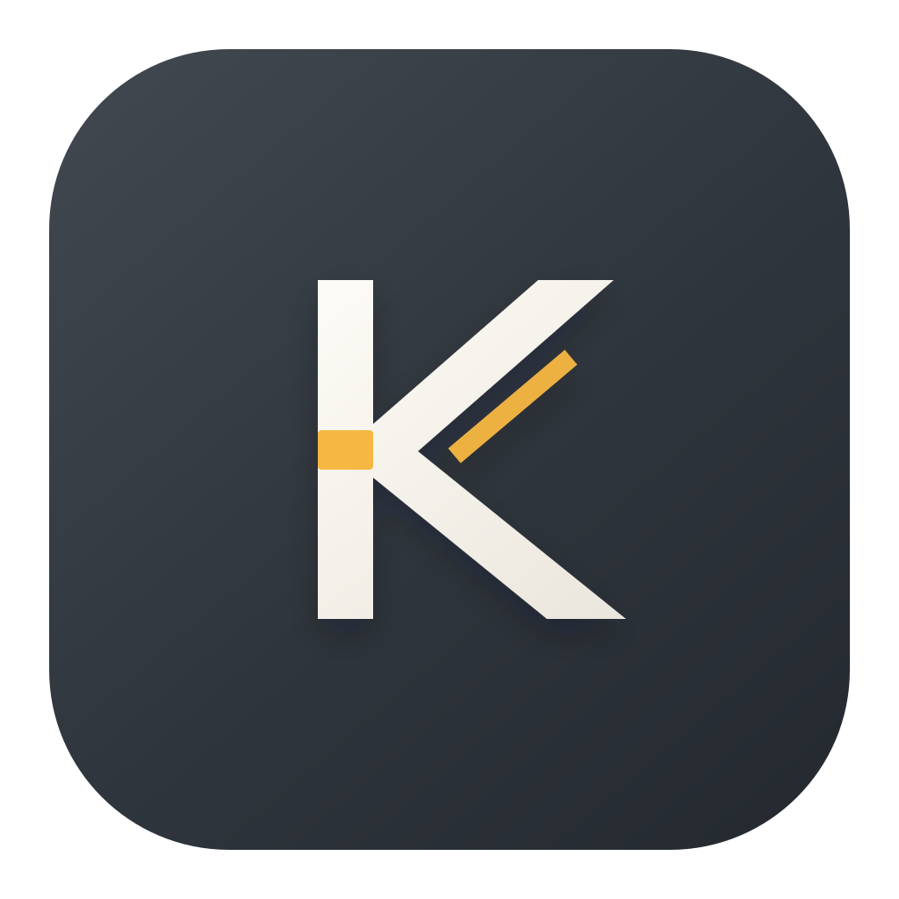
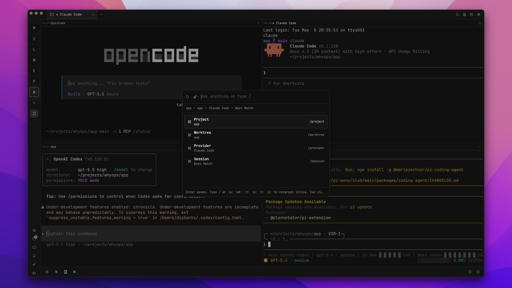

<p align="center">
  
</p>

<h1 align="center">Kaji</h1>

<p align="center">
  Native macOS command center for terminal-native AI coding agents.
</p>

<p align="center">
  Run Codex, Claude Code, OpenCode, Pi, and terminal sessions across projects and worktrees without losing context, control, or verification.
</p>

<div align="center">
  
  
  
  
</div>

## Screenshot



## What Is Kaji?

Kaji is a local operations layer for AI coding work.

Instead of managing a pile of terminal windows, Kaji keeps projects, worktrees, panes, agent runs, notifications, changed files, diffs, and verification state inside one native macOS app.

It is built with SwiftUI and embeds pinned upstream [Termy](https://github.com/lassejlv/termy) through `TermyKit` and `TermySwiftEmbed` for native terminal emulation and AppKit rendering.

## Core Features

### AI Agent Workflow And Command Center

- **Cmd+K Ask palette**: send prompts to Codex, Claude Code, OpenCode, Pi, or a normal terminal.
- **Inline routing**: target a project, worktree, provider, session mode, history session, skill, task recipe, file mention, attachment, or KajiKit script from one input.
- **Session-aware dispatch**: reuse a matching live session, choose an existing session, resume provider history, or force a new terminal.
- **Saved task recipes**: built-in recipes for fixing tests, reviewing diffs, explaining repos, debugging errors, updating docs, preparing commits, and implementing features.
- **KajiKit scripts**: store and run reusable project/global commands from `~/.kajikit`, with risky-command confirmation.
- **Cmd+J Agent Command Center**: jump to an agent run, reply, stop, resume, start a new run, verify, open changed files, or review diffs.
- **Agent Mission Control**: sidebar surface for active and recent agent runs with provider, project, worktree, status, last event, changed files, and verification state.
- **Run evidence**: completed runs can attach git changed-file snapshots and expose per-file open/diff actions.
- **Verification**: run configured checks for a project, or default Swift package verification with `swift build && swift test`.

#### Cmd+K Routing Tokens
Type these anywhere in the Ask palette prompt, then choose from the highlighted matches.

| Token | Routes or action |
| --- | --- |
| `:p:`, `:wt:` | Project and worktree |
| `:t:` | Provider: `terminal`, `codex`, `claude`, `opencode`, or `pi` |
| `:m:` | Session mode: `best`, `existing`, or `new` |
| `:h:`, `:s:` | Provider history and skill, unavailable for Terminal |
| `:task:`, `:ta:`, `:te:`, `:td:` | Run, add, edit, or delete saved task recipes |
| `:pa:` | Add a project from a directory path |
| `:attach:` | Attach files, folders, or images |
| `:x:`, `:xa:`, `:xe:`, `:xd:` | Run, add, edit, or delete KajiKit scripts |
| `@path` | Attach file or folder context from the current worktree |
| `/project`, `/worktree`, `/provider`, `/session` | Slash-command aliases for the main route pickers |

### Parent Agent And Providers

- Kaji includes a native Parent Agent surface backed by a bundled Kaji runtime that uses Pi npm packages.
- The Parent Agent can plan work, choose provider/model options, spawn child agents, send follow-up prompts, observe runs, stop/resume agents, and jump back to live panes.
- It can create isolated Rift workspaces for subagents, collect changed files, open native diffs, and start verification while Kaji remains the source of truth for projects, worktrees, pane IDs, permissions, and UI state.
- Kaji also supports Pi as a normal coding provider alongside Codex, Claude Code, and OpenCode.
- **Codex**: launcher, history/resume support, local session monitoring, activity hooks, completion events, usage tracking.
- **Claude Code**: launcher, history support, user-prompt, stop, notification, and permission-request hooks, usage tracking.
- **OpenCode**: launcher, history support, plugin-based activity, transcript, question, permission, and completion events.
- **Pi**: launcher, model listing, history support, skill invocation, project/global instruction and skill directories.
- **Terminal**: normal shell sessions with the same project/worktree routing and split/tab model.

### Project And Worktree Workspace

- Project-first sidebar for local repositories and workspaces.
- Per-project worktree discovery, selection, creation, and persistence.
- Workspace state is stored per worktree: tabs, split layouts, active selections, editor tabs, VCS tabs, and focus.
- Safe parallel AI workflows are easier because each run can be tied to an exact project/worktree.

### Terminal, Editor, And VCS

- Termy-powered native terminal surfaces with AppKit rendering.
- Tabs, splits, pane focus, pane movement, terminal search, and long-running session continuity.
- File tree, quick open, native editor tabs, markdown preview/split modes, and syntax highlighting.
- Built-in VCS surface for status, diffs, branch switching, commit history, worktree creation, and PR actions through `gh`.
- Diff viewer tabs for reviewing files changed by humans or agents.

### Notifications And Remote Delivery

- Native bundled `KajiHookClient` receives provider events through macOS `DistributedNotificationCenter`.
- Every Kaji terminal exports context variables such as `KAJI_PANE_ID`, `KAJI_PROJECT_ID`, `KAJI_WORKTREE_ID`, and `KAJI_HOOK_CLIENT_PATH`.
- In-app toasts, sounds, unread badges, notification panel, and agent activity tracking are built in.
- Remote notification destinations support `ntfy` and custom HTTP webhooks.
- Routing rules can match by source and event kind, such as Codex completed, Claude Code attention, OpenCode error, Terminal info, or custom events.

### Customization And Operations

- Configurable keyboard shortcuts for tabs, panes, projects, quick open, Ask, Agent Command Center, VCS, worktrees, file tree, AI usage, and navigation.
- Theme picker, Termy theme import/export, user themes, transparency settings, and shared Kaji UI tokens.
- CLI launcher settings for enabling/disabling agents and overriding commands.
- AI usage board for supported providers including Codex, Claude Code, Copilot, Amp, Z.ai, MiniMax, Kimi, and Factory.
- Sparkle update support for packaged releases.

## Default Shortcuts

| Shortcut | Action |
| --- | --- |
| `Cmd+K` | Ask palette |
| `Cmd+J` | Agent Command Center |
| `Cmd+P` | Quick open |
| `Cmd+Shift+O` | Switch worktree |
| `Cmd+Shift+G` | Source control |
| `Cmd+D` | Split right |
| `Cmd+Shift+D` | Split down |
| `Cmd+T` | New tab |
| `Cmd+W` | Close tab |
| `Cmd+Shift+W` | Close pane |
| `Cmd+E` | Toggle file tree |
| `Cmd+B` | Toggle sidebar |
| `Cmd+L` | Toggle AI usage |
| `Cmd+Shift+K` | Theme picker |

Shortcuts can be changed in Settings.

## Install

### Homebrew

```bash
brew tap dishant0406/kaji
brew install --cask kajikit
```

Kaji is currently distributed as an unsigned developer preview. The Homebrew cask removes the macOS quarantine attribute after install so Kaji can launch.

### Manual

Download the latest release from the [releases page](https://github.com/dishant0406/kaji/releases).

## Requirements

- macOS 15+
- Swift 6.0+ for local development
- Xcode command line tools
- `gh` installed for GitHub PR actions
- Node.js installed for the Parent Agent runtime
- Optional provider CLIs: `codex`, `claude`, `opencode`, `pi`

## Local Development

```bash
scripts/setup.sh          # Build TermyKit/libtermy and bundled Rift from pinned sources
swift build               # Debug build
swift run Kaji           # Run from SwiftPM
./start.sh                # Open the preview lab and launch a real Kaji.app bundle
scripts/checks.sh --fix   # Format, lint, and build
```

`scripts/setup.sh` builds the pinned Termy FFI dylib, syncs Termy shell integration assets, and installs the patched bundled Rift binary used for isolated workspaces. See [docs/building-termy.md](docs/building-termy.md).

`./start.sh` is the fastest supported app workflow in this repo. It opens `Kaji/Previews/DeveloperPreviewLab.swift` in Xcode for SwiftUI previews and launches a real `Kaji.app` bundle through `script/build_and_run.sh`.

## Architecture

```text
Kaji/                       SwiftUI macOS app target
KajiHookClient/             Native provider hook helper
KajiParentAgentRuntime/      TypeScript Parent Agent runtime using Pi packages
TermyKit/                    C module exposing termy.h and libtermy_ffi.dylib
Vendor/TermySwiftEmbed/       Embedded Swift/AppKit Termy terminal surface
Tests/KajiTests/            Swift Testing suite
docs/                        Architecture, release, and integration docs
scripts/                     Setup, checks, packaging, and release scripts
```

Core runtime pieces include `TermyService`, `TermyTerminalNSView`, `AppState`, `WorkspaceReducer`, `CodingAgentRegistry`, `AgentRunStore`, and `ParentAgentController`.

Read the full architecture guide in [docs/architecture.md](docs/architecture.md). Provider hooks and custom notification usage are documented in [docs/notification-setup.md](docs/notification-setup.md).

## Release

Release automation lives in [.github/workflows/release.yml](.github/workflows/release.yml).

It builds signed DMGs for Apple Silicon and Intel, generates Sparkle appcasts, and updates the Homebrew cask tap.

For the local patch-bump, commit, push, and DMG flow:

```bash
scripts/release-local.sh --message "Release message" --all
```

See [docs/releasing.md](docs/releasing.md) for release secrets, signing, appcast, and tap setup.

## License

[MIT](LICENSE)
