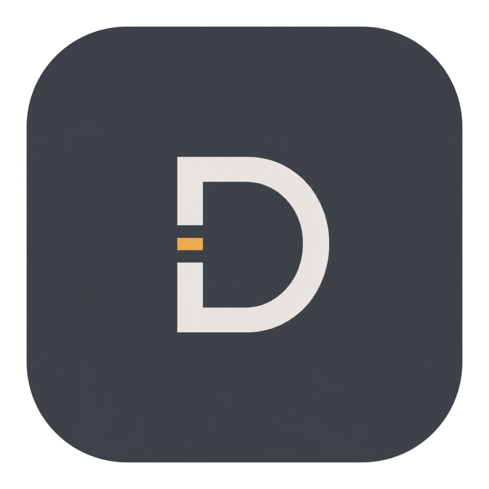
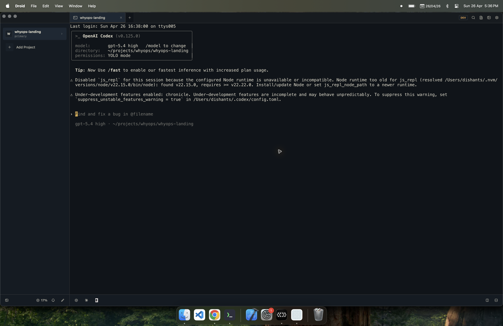

<p align="center">
  
</p>

<h1 align="center">Droid</h1>

<p align="center">Project-based terminal workspace for macOS, built with SwiftUI and <a href="https://github.com/ghostty-org/ghostty">libghostty</a>.</p>
<p align="center"><a href="https://discord.gg/4eMXAmJQ2n">Discord</a></p>

<div align="center">
  
  
  
  
</div>

## Screenshots



## Features

- **Project workspaces** — Organize terminals around projects and worktrees instead of a flat tab list
- **Ghostty-powered terminal** — Native macOS rendering through upstream `ghostty-org/ghostty`
- **Tabs and splits** — Open terminal, editor, diff, and VCS tabs with side-by-side or stacked splits
- **Built-in VCS** — Branch switching, diffs, PR actions, worktree creation, and source-control surfaces in-app
- **CLI launcher footer** — One-click launchers for Codex, Claude Code, OpenCode, and a default terminal
- **Workspace persistence** — Project selection, tab trees, focus, and worktree layouts are restored across launches
- **In-app settings** — Theme, shortcuts, CLI launchers, transparency, notifications, and AI usage live inside the app
- **Keyboard-first flow** — Configurable shortcuts for projects, tabs, splits, quick open, and workspace actions
- **Theme-driven UI** — Dark Droid theme with shared token-based micro components instead of native control chrome
- **Sparkle updates** — Signed releases, appcasts, and auto-update support for packaged builds

## Requirements

- macOS 14+
- Swift 6.0+
- Ghostty installed (optional for themes)
- `gh` installed (optional for PR management)

## Install

### Homebrew

```bash
brew tap dishant0406/droid
brew install --cask droid
```

Droid is currently distributed as an unsigned developer preview. The Homebrew cask removes the macOS quarantine attribute after install so Droid can launch.

### Manual

Download the latest release from the [releases page](https://github.com/dishant0406/droid/releases).

## Local Development

```bash
scripts/setup.sh          # builds GhosttyKit.xcframework from ghostty-org/ghostty
swift build               # debug build
swift run Droid           # run
./start.sh                # opens the preview lab in Xcode and launches the app bundle
```

`scripts/setup.sh` requires Xcode and `gettext`. If a matching Zig toolchain is not already installed, the script downloads the Ghostty-required Zig version temporarily. See [docs/building-ghostty.md](docs/building-ghostty.md) for details.

## Dev Loop

`./start.sh` is the fastest supported macOS workflow in this repo:

- it opens [`Droid/Previews/DeveloperPreviewLab.swift`](Droid/Previews/DeveloperPreviewLab.swift) in Xcode for live SwiftUI previews
- it launches a real `Droid.app` bundle from [`script/build_and_run.sh`](script/build_and_run.sh)

This is not a web-style dev server. The live updates come from Xcode's preview canvas, while the running app stays available as a separate real app window.

## Release Setup

Release automation lives in [`.github/workflows/release.yml`](.github/workflows/release.yml).

- It builds signed DMGs for Apple Silicon and Intel
- It generates Sparkle appcasts for auto-updates
- It updates the Homebrew cask tap automatically

See [docs/releasing.md](docs/releasing.md) for the required secrets and tap setup.

### Local Release Wrapper

For the local patch-bump, commit, push, and DMG flow:

```bash
scripts/release-local.sh --message "Release message" --all
```

It stages changes when `--all` is passed, bumps `Droid/Info.plist`, pushes the current branch, runs `scripts/build-release.sh`, verifies the DMG, and prints the checksum.

## License

[MIT](LICENSE)
