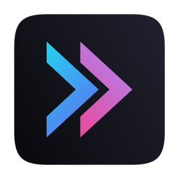

<p align="center">
  
</p>

<h1 align="center">Droid</h1>

<p align="center">Lightweight and Memory efficient terminal for Mac built with SwiftUI and <a href="https://github.com/ghostty-org/ghostty">libghostty</a>.</p>
<p align="center"><a href="https://discord.gg/4eMXAmJQ2n">Discord</a></p>

<div align="center">
  
  
  
  
</div>

## Screenshots


## Features

- **Project-based workflow** — Organize terminals by project with persistent workspace state
- **Vertical tabs** — Sidebar tab strip with drag-and-drop reordering, pinning, renaming, and middle-click close
- **Split panes** — Horizontal and vertical splits with keyboard navigation and resizable dividers
- **Built-in VCS** — Simple and lightweight basic git diff and operations
- **200+ themes** — Browse and search Ghostty themes with a built-in theme picker
- **Customizable shortcuts** — 40+ configurable keyboard shortcuts with conflict detection
- **Workspace persistence** — Tabs, splits, and focus state are saved and restored per project
- **In-terminal search** — Find text in terminal output with match navigation
- **Drag and drop** — Reorder tabs and projects, drag tabs between panes to create splits
- **Auto-updates** — Built-in update checking via Sparkle
- **Text Editor** - Native, Lightweight Text (not code) Editor with code highlight support for most of the programming languages

## Requirements

- macOS 14+
- Swift 6.0+
- Ghostty installed (optional for themes)
- `gh` installed (optional for PR management)

## Install

### Homebrew

```bash
brew tap droid-app/tap
brew install --cask droid
```

### Manual

Download the latest release from the [releases page](https://github.com/droid-app/droid/releases)

## Local Development

```bash
scripts/setup.sh          # builds GhosttyKit.xcframework from ghostty-org/ghostty
swift build               # debug build
swift run Droid           # run
./start.sh                # opens the preview lab in Xcode and launches the app bundle
```

`scripts/setup.sh` requires Xcode and `gettext`. If a matching Zig toolchain is not already installed, the script downloads the Ghostty-required Zig version temporarily. See [docs/building-ghostty.md](docs/building-ghostty.md) for details.

## Dev Loop

`./start.sh` is the fastest supported macOS workflow in this repo:

- it opens [`Droid/Previews/DeveloperPreviewLab.swift`](Droid/Previews/DeveloperPreviewLab.swift) in Xcode for live SwiftUI previews
- it launches a real `Droid.app` bundle from [`script/build_and_run.sh`](script/build_and_run.sh)

This is not a web-style dev server. The live updates come from Xcode's preview canvas, while the running app stays available as a separate real app window.

## License

[MIT](LICENSE)
